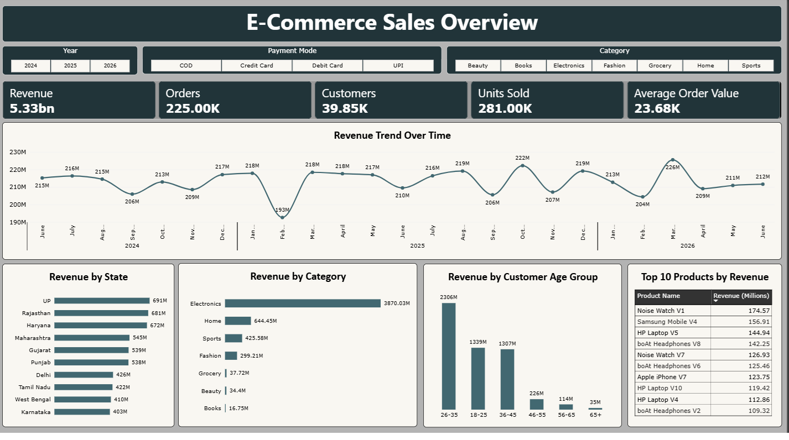
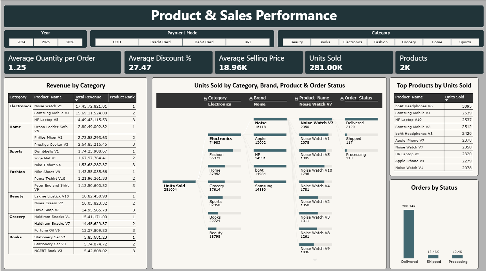
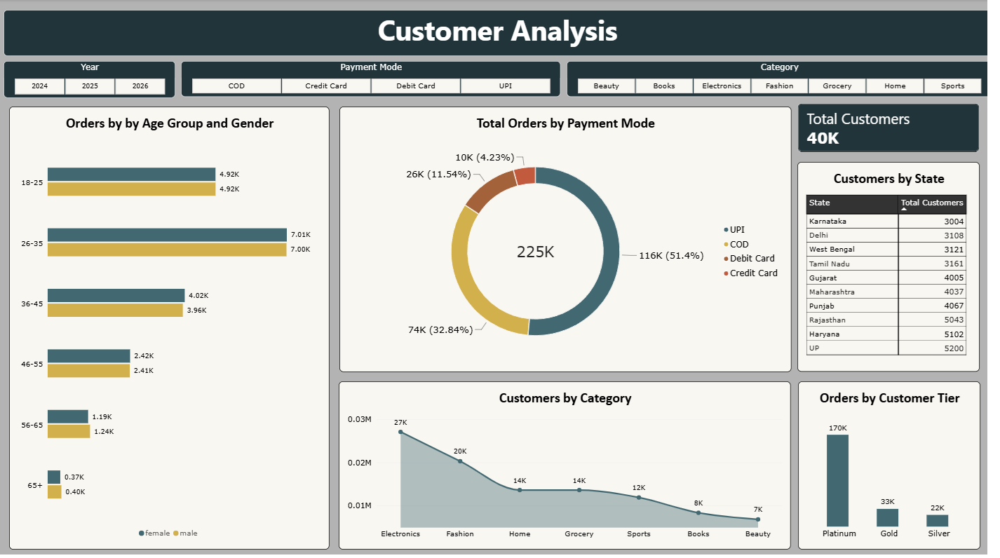
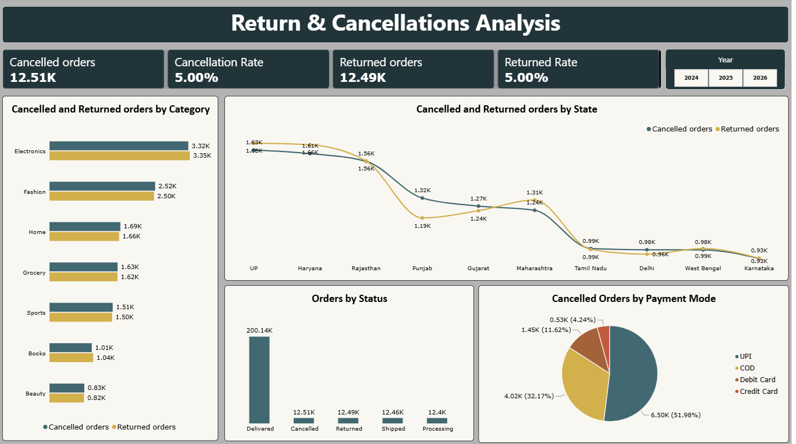

# Indian E-Commerce Sales Analytics

An end-to-end portfolio project using SQL and Power BI to analyze e-commerce sales, product performance, customer segments, returns, and cancellations.

## Project overview

This project explores sales and customer data to answer practical business questions. SQL scripts cover data profiling, data quality checks, exploratory analysis, and business analysis. The Power BI report presents the results across four report pages.

## Dashboard screenshots

### Executive Sales Overview

### Product & Sales Performance

### Customer Analysis

### Return & Cancellations Analysis

## Business questions

- How do revenue, orders, and units sold change over time?
- Which products and categories generate the most revenue and units sold?
- Which states generate the highest revenue?
- Which customer age groups contribute the most revenue, and how do orders vary across customer tiers?
- Which payment methods are used most often?
- What are the return and cancellation rates, and how do returned and cancelled orders vary by state and category?

## Tools

- **SQL Server / T-SQL** — data profiling, validation, and business analysis
- **Power BI Desktop** — data model, measures, and interactive report
- **GitHub** — version control and project documentation

## Dataset

- **Dataset source:** Indian E-Commerce Sales Analytics Dataset, https://www.kaggle.com/datasets/jatinkhandelwal112/indian-e-commerce-sales-analytics-dataset/data
- **Date coverage:** 2024-06-01 to 2026-06-30
- **License:** CC0: Public Domain

## Key findings
- Monthly revenue peaked in March 2026 at 22,56,18,071.57 (about 225.62 million).
- Electronics generated the highest category revenue, at 3,870.03M.
- Uttar Pradesh had the highest state revenue at 69,14,95,333.88 (approximately 691.50M).
- UPI was the most-used payment method, with 115,651 orders (51.4%); COD followed with approximately 74,000 orders (32.84%).
- Samsung Mobile V4 and HP Laptop V10 had nearly identical unit sales, at 2,539 and 2,537 units respectively.

## Notes
The SQL view vw_Valid_Sales excludes cancelled and returned orders.

## Author
Sunanda Seeramsetty · GitHub https://github.com/sunanda-p

